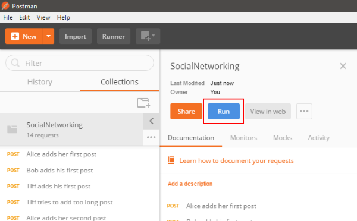
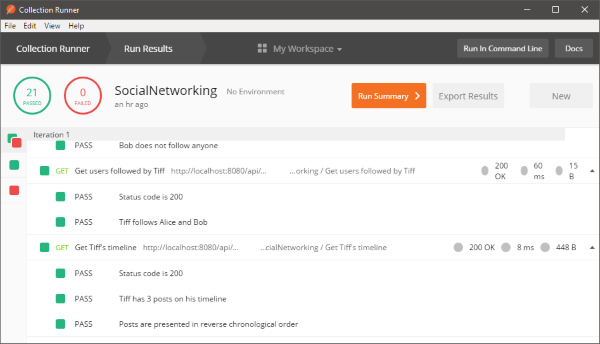

# SocialNetworkingChallenge

## Getting Started
### Prerequisites
- Git
- Java
- [Maven 3](https://maven.apache.org)
- [Wildfly](http://wildfly.org) (tested on Wildfly 11)
- [Postman](https://www.getpostman.com/) or [newman](https://www.npmjs.com/package/newman) (for tests)

### Building
1. Checkout the repository
```
git clone https://github.com/AdrianKMichalski/SocialNetworkingChallenge.git
```

2. Change the working directory
```
cd SocialNetworkingChallenge
```

3. Build everything via Maven
```
mvn clean install
```

### Deployment
1. Start Wildfly 11
2. Deploy `%SOCIAL_NETWORKING_HOME%/social-networking-core/target/social-networking-core.war` file to Wildfly using *jboss-cli* or copy it to the `%WILDFLY_HOME%/standalone/deployments` directory.
3. After succesful deployment (with default Wildfly's settings) API should be exposed under `http://localhost:8080/api/`

### Running tests
#### With newman
1. Go to the *tests* directory
2. Run tests using
```
newman run SocialNetworking.postman_collection.json
```

#### With Postman
1. Import collection from *tests* directory
2. Run tests with Collection Runner



## Copyright
Copyright &copy; 2018 Adrian Michalski